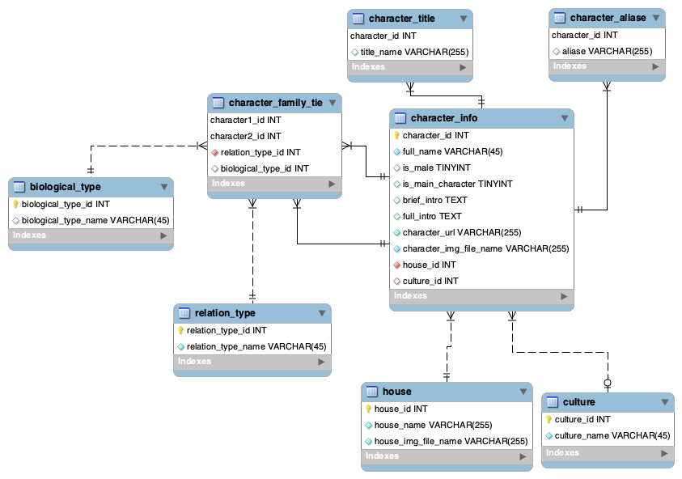

# A Wiki For Game of Throne

## Purpose

Being a fan of tv shows, I am interested in building a wiki-like Django application for one particular tv series. With the large number of characters, super complicated relationships, and especially the popularity, Game of Throne becomes the best choice. 

There are three tabs in this website: 

1. Lead characters: displays 83 leading characters.
2. All characters: displays all 1000+ characters.
3. Search page: user can search characters by character name, culture or house


The main challenge is how to correctly retrieve and display family tie for each character from database. 

## Data set: 

_scraped from [Fandom](https://gameofthrones.fandom.com/wiki/Game_of_Thrones_Wiki),  [HBO offical site](https://www.hbo.com/game-of-thrones/cast-and-crew), requested from [GOT-API](https://api.got.show/doc/)_

the final ready to use data files are in /static/csv directory.

Since characters data are collected from multiple sources, the name of same characters may saved in different aliases and different characters may have the same name, different data source treat them in different ways (for example: Aerion Targaryen, Aerion Targaryen (son of Daemion)). Although I cleaned some characters' names,  it's still hard to perfectly match those names and assemble all information together. 

## Data model:



There are 8 tables in total, character is the main entity, all other tables are related to it.

#### character_info:

> information of characters

`character_id`: primary key for character.

`full_name`: name of the character. such as 'Jon Snow'

`is_male`: gender of the character. male: 1, female: 0 

`is_main_character`: if the character is main character. true: 1, false: 0 (_data scraped from [HBO offical site](https://www.hbo.com/game-of-thrones/cast-and-crew)_)

`brief_intro`: short introduction for the character. only main characters have brief_intro  (_data scraped from [HBO offical site](https://www.hbo.com/game-of-thrones/cast-and-crew)_)

`full_intro`: long introduction for the character. all characters have full_intro (_data scraped from [Fandom](https://gameofthrones.fandom.com/wiki/Game_of_Thrones_Wiki)_)

`character_url`: url of external link for the character.  (_data scraped from [Fandom](https://gameofthrones.fandom.com/wiki/Game_of_Thrones_Wiki)_)

`character_img_file_name`: image file name for the character. only main characters have image file. (_data scraped from [HBO offical site](https://www.hbo.com/game-of-thrones/cast-and-crew)_)

`house_id`: belonged house for the character. foreign key refers to table **house**.

`culture_id`: belonged culture for the character. foreign key refers to table **culture**.

#### character_family_tie(many to many relationship)

> family tie between characters. 
>
> e.g. character2(Jon Snow) is the biological_type(adoptive) relation_type(descendant) of character1(Eddard Stark)

`character1_id`: the character that starts the relationship.

`character2_id`: the character that this relationship points at.

`relation_type_id`: relation type,  foreign key refers to table **relation_type**.

`biological_type_id`: biological type,  foreign key refers to table **biological_type**.

#### character_title

`character_id`: foreign key refers to table character_info.

`title_name`: title of the character, one character may have multiple titles.

#### character_aliases

`character_id`: foreign key refers to table character_info.

`aliase`: aliase of the character, one character may have multiple aliases.

## Package Dependencies

```
certifi                2018.11.29
chardet                3.0.4     
coreapi                2.3.3     
coreschema             0.0.4     
defusedxml             0.5.0     
Django                 2.1.4     
django-allauth         0.38.0    
django-cors-headers    2.4.0     
django-crispy-forms    1.7.2     
django-filter          2.0.0     
django-rest-auth       0.9.3     
django-rest-swagger    2.2.0     
djangorestframework    3.9.0     
idna                   2.8       
itypes                 1.1.0     
Jinja2                 2.10      
MarkupSafe             1.1.0     
mysqlclient            1.3.14    
oauthlib               2.1.0     
openapi-codec          1.3.2     
pip                    18.1      
PyJWT                  1.7.1     
python3-openid         3.1.0     
pytz                   2018.7    
PyYAML                 3.13      
requests               2.21.0    
requests-oauthlib      1.0.0     
setuptools             40.6.3    
simplejson             3.16.0    
six                    1.12.0    
social-auth-app-django 3.1.0     
social-auth-core       2.0.0     
uritemplate            3.0.0     
urllib3                1.24.1    
wheel                  0.32.3 
```


## Future work

1. Since there are two extra fields in the many to many table, I haven't figured out a way to let user edit (add/update/delete) family tie in character update page. I tried to use `inlineformset_factory`, but it doesn't work as expected. So I separately add a new page `new relationship` to create new many to many relationship. However, user can edit family tie in character detail page in admin site.
2. Missing relation auto-update function for now. The family relation ship should be bidirectional, i.e. if user add A is B's father, it should automatically add a new relationship (B is A's descendant). 
3. Editing relation in REST API. User is not able to edit the additional fields `relation_type` and`biological_type`. 

